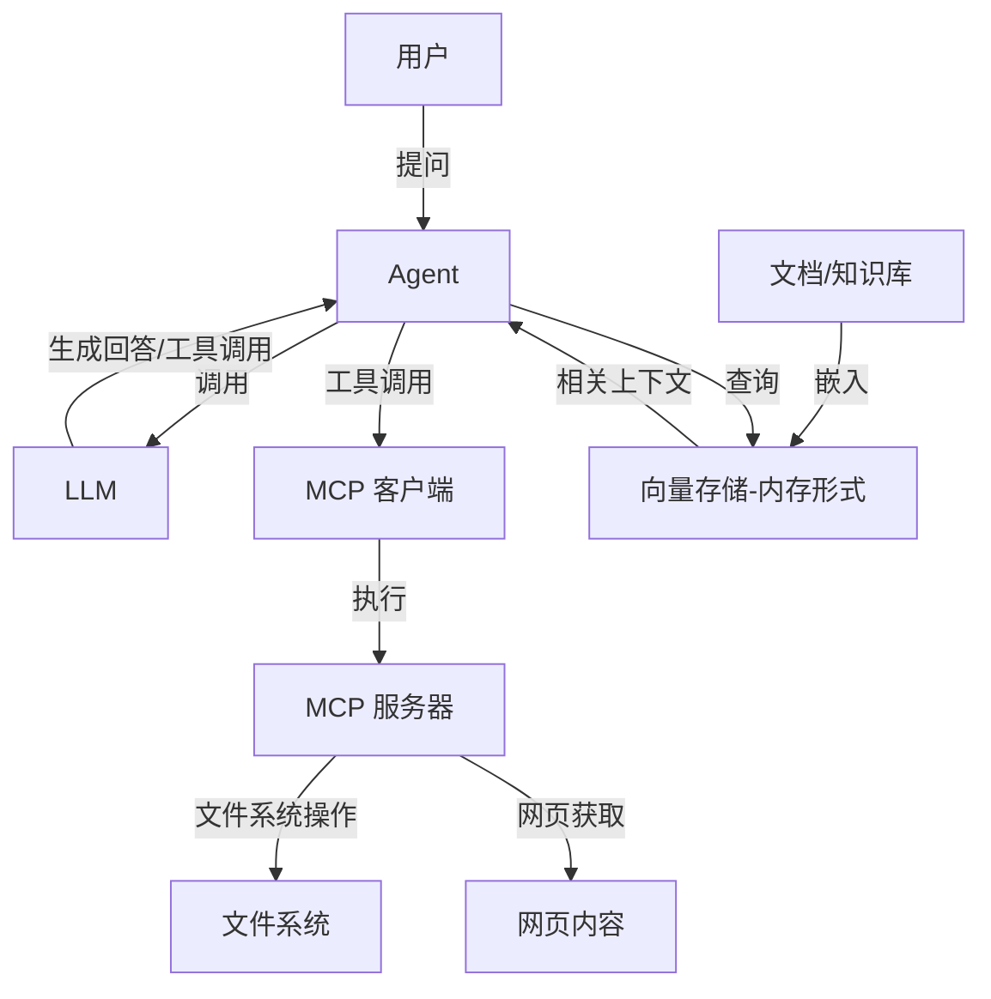
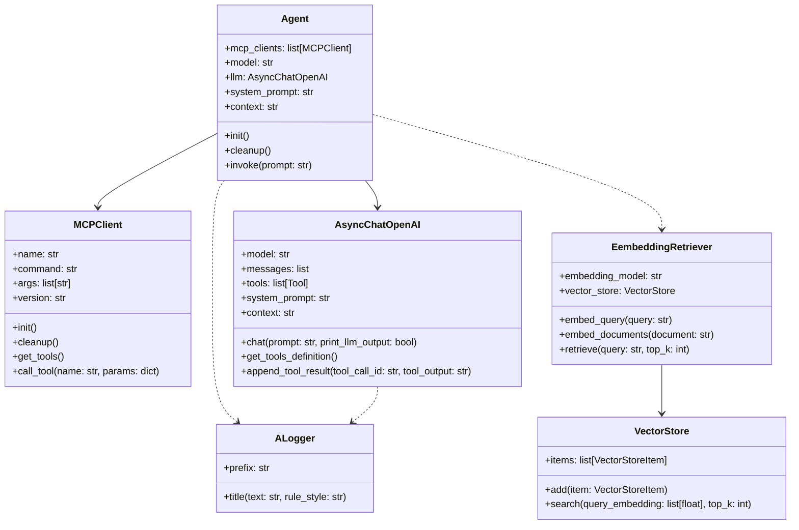
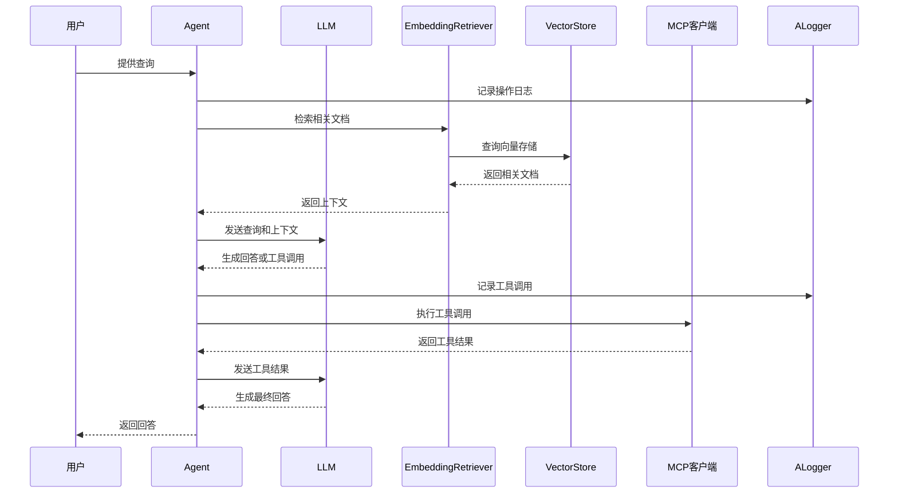

# LLM-MCP-RAG AGRENT项目

## 项目简介

本项目是一个基于大语言模型（LLM）、模型上下文协议（MCP）和检索增强生成（RAG）的项目。它展示了如何构建一个能够与外部工具交互并利用检索增强生成技术的 AI 助手系统。

### 核心功能

- 基于 OpenAI API 的大语言模型调用
- 通过 MCP（Model Context Protocol）实现 LLM 与外部工具的交互
- 实现基于向量检索的 RAG（检索增强生成）系统
- 支持文件系统操作和网页内容获取

## 系统架构

## 主要组件

## 快速开始

### 环境准备

1. 确保已安装 Python 3.12 或更高版本
2. 克隆本仓库
3. 复制 `.env.example` 为 `.env` 并填写必要的配置信息：
   - `OPENAI_API_KEY`: OpenAI API 密钥
   - `OPENAI_BASE_URL`: OpenAI API 基础 URL, 注意要保留后面的'/v1' (默认为 'https://api.openai.com/v1')
   - `DEFAULT_MODEL_NAME`: (可选) 默认使用的模型名称（默认为 "gpt-4o-mini"）
   - `EMBEDDING_KEY`: (可选) 嵌入模型 API 密钥（默认为 $OPENAI_API_KEY）
   - `EMBEDDING_BASE_URL`: (可选) 嵌入模型 API 基础 URL, 如硅基流动的API或兼容OpenAI格式的API （默认为 $OPENAI_BASE_URL）
   - `USE_CN_MIRROR`: (可选) 是否使用中国镜像, 设置任意值(如'1')为 true (默认为 false)
   - `PROXY_URL`: (可选) 代理 URL (如 "http(s)://xxx"), 用于 `fetch` (mcp-tool) 走代理

## RAG 示例流程

## 项目结构

  - `agent.py`: Agent 实现，负责协调 LLM 和工具
  - `LLM.py`: OpenAI API 客户端封装
  - `McpClient.py`: MCP 客户端实现
  - `embedding_retriever.py`: 嵌入检索器实现
  - `vector_store.py`: 向量存储实现
  - `utils/`: 工具函数
    

## 学习资源

- [Model Context Protocol (MCP)](https://modelcontextprotocol.io/): 了解 MCP 协议
- [OpenAI API 文档](https://platform.openai.com/docs/api-reference): OpenAI API 参考
- [RAG (Retrieval-Augmented Generation)](https://arxiv.org/abs/2005.11401): RAG 技术论文
